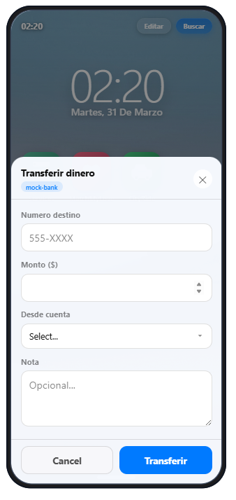
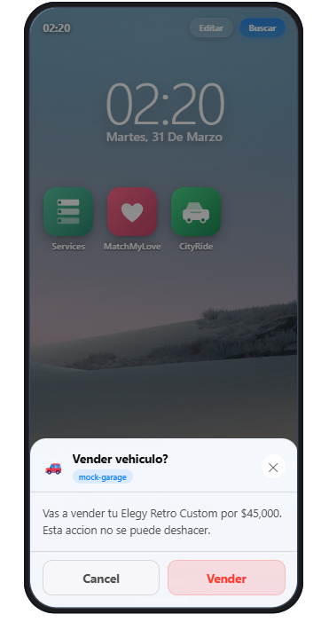
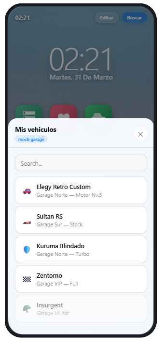
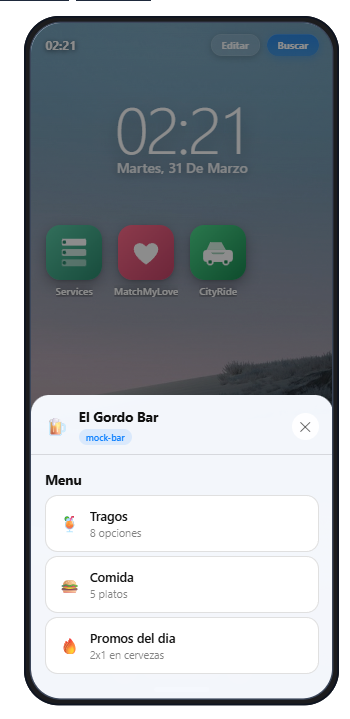
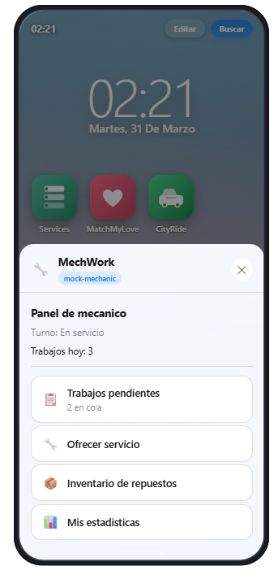
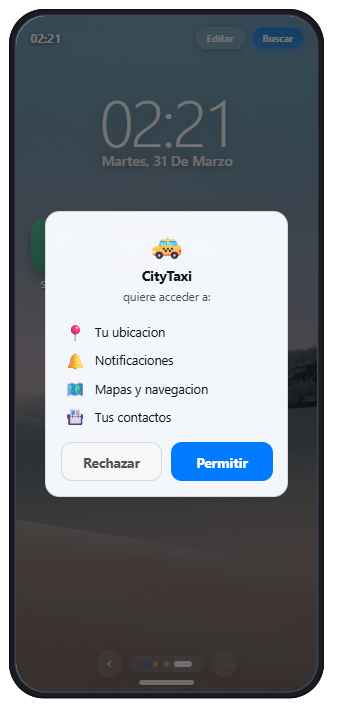

# Phone UI SDK

The Phone UI SDK lets external FiveM resources create rich phone interfaces without writing SolidJS code. All UIs are rendered using the phone's native components and follow its visual design automatically.

Two API modes are available:

- **Direct dialogs** — one-shot blocking calls for inputs, confirmations, and selections
- **Registered UIs** — multi-view apps registered by ID, opened on demand

All exports are invoked via `exports['gcphone-next']:ExportName(...)`.

## Screenshots

| Input Dialog | Confirm | Select List |
|:---:|:---:|:---:|
|  |  |  |

| Bar (Multi-view) | Mechanic (Complex) | Permissions |
|:---:|:---:|:---:|
|  |  |  |

> **Warning about third-party apps:** Apps registered by external resources can request sensitive permissions (contacts, messages, location). If an app comes from an unknown or untrusted source, it can be potentially harmful — for example, reading contacts and sending spam. The permission system protects the player by showing what access each app requests before granting it. Players can remove suspicious apps from Settings > Apps and Permissions. As a server administrator, review the resources you install and the permissions they request.

---

## Direct Dialogs

### `phoneInput(title, elements, options?)`

Opens a form dialog with declarative input elements. Blocks the Lua thread until the player submits or cancels.

**Side:** Client

| Parameter | Type | Required | Description |
|-----------|------|----------|-------------|
| `title` | `string` | Yes | Modal title (max 40 chars) |
| `elements` | `table[]` | Yes | Array of element definitions (max 20). See [Element Types](#element-types). |
| `options` | `table` | No | `submitLabel`, `submitTone`, `cancelLabel` |

**Returns:** `table|nil` — form data as `{ [id] = value }` or `nil` if cancelled/timed out.

```lua
local result = exports['gcphone-next']:phoneInput('Transferir dinero', {
  { type = 'input', id = 'target', label = 'Numero de telefono', required = true, maxLength = 20 },
  { type = 'number', id = 'amount', label = 'Monto', required = true, min = 1, max = 100000 },
  { type = 'textarea', id = 'note', label = 'Nota (opcional)', maxLength = 200 },
}, {
  submitLabel = 'Transferir',
  submitTone = 'primary',
})

if result then
  print(result.target, result.amount, result.note)
end
```

---

### `phoneConfirm(title, options?)`

Opens a yes/no confirmation dialog.

**Side:** Client

| Parameter | Type | Required | Description |
|-----------|------|----------|-------------|
| `title` | `string` | Yes | Confirmation question (max 40 chars) |
| `options` | `table` | No | `description`, `icon`, `confirmLabel`, `confirmTone`, `cancelLabel` |

**Returns:** `boolean` — `true` if confirmed, `false` if cancelled.

```lua
local confirmed = exports['gcphone-next']:phoneConfirm('Vender vehiculo?', {
  description = 'Vas a vender tu Elegy Retro por $45,000.',
  confirmLabel = 'Vender',
  confirmTone = 'danger',
  icon = '🚗',
})

if confirmed then
  SellVehicle(source)
end
```

---

### `phoneSelect(title, items, options?)`

Opens a selection list. The player picks one item.

**Side:** Client

| Parameter | Type | Required | Description |
|-----------|------|----------|-------------|
| `title` | `string` | Yes | List title (max 40 chars) |
| `items` | `table[]` | Yes | Array of selectable items (max 50). See [List Items](#list-items). |
| `options` | `table` | No | `searchable` (boolean), `cancelLabel` |

**Returns:** `string|nil` — the selected item's `id`, or `nil` if cancelled.

```lua
local vehicleId = exports['gcphone-next']:phoneSelect('Elige vehiculo', {
  { id = 'elegy', label = 'Elegy Retro Custom', description = 'Sport — A+', icon = '🚗' },
  { id = 'sultan', label = 'Sultan RS', description = 'Sport — S', icon = '🏎️' },
}, {
  searchable = true,
})

if vehicleId then
  SpawnVehicle(vehicleId)
end
```

---

## Registered UIs

For multi-view apps (garage, mechanic, shops, etc.). Register once, open by ID.

### `registerPhoneUI(id, definition)`

Registers a UI definition. Call once on resource start.

**Side:** Server

| Parameter | Type | Required | Description |
|-----------|------|----------|-------------|
| `id` | `string` | Yes | Unique app identifier (max 64 chars) |
| `definition` | `table` | Yes | Full UI definition. See below. |

**Returns:** `controller|nil, string?` — a controller object on success, or `nil` with error reason.

The controller provides methods to interact with the registered app: `open`, `close`, `notify`, `setVisible`, `setVisibleAll`, `onOpened`, `onResult`, `unregister`. See [Controller Handle](#controller-handle) below.

**Definition structure:**

```lua
{
  title = 'App Title',           -- max 40 chars
  icon = '🔧',                   -- emoji icon (max 8 chars)

  -- Optional: appear in Shortcuts/Servicios app
  shortcut = {
    visible = true,              -- show in Shortcuts by default
    category = 'services',       -- food, services, garage, shop, entertainment, other
    description = 'Description', -- max 120 chars
  },

  -- Optional: required permissions
  permissions = { 'location', 'notifications' },

  -- Views (screens)
  views = {
    main = {
      elements = { ... },        -- max 20 elements per view
      options = { ... },          -- max 4 action buttons per view
    },
    second_view = {
      title = 'Custom Title',    -- overrides app title for this view
      elements = { ... },
      options = { ... },
    },
  },
  startView = 'main',           -- which view to show first
}
```

**Limits:**
- Max 10 views per UI
- Max 20 elements per view
- Max 4 action buttons per view
- Max 20 registered UIs per resource

```lua
CreateThread(function()
  exports['gcphone-next']:registerPhoneUI('my_garage', {
    title = 'Mi Garage',
    icon = '🚗',
    shortcut = {
      visible = true,
      category = 'garage',
      description = 'Administra tus vehiculos',
    },
    views = {
      main = {
        elements = {
          { type = 'header', text = 'Tus vehiculos' },
          { type = 'list', id = 'vehicle', items = {
            { id = 'elegy', label = 'Elegy Retro', description = 'Garage Norte', icon = '🚗' },
            { id = 'sultan', label = 'Sultan RS', description = 'Garage Sur', icon = '🏎️' },
          }},
        },
      },
    },
    startView = 'main',
  })
end)
```

---

### `openPhoneUI(id)` / `openPhoneUI(id, source)`

Opens a registered UI. Blocks until the player interacts.

**Side:** Client (without source) or Server (with source)

| Parameter | Type | Required | Description |
|-----------|------|----------|-------------|
| `id` | `string` | Yes | Registered UI identifier |
| `source` | `integer` | Server only | Player source |

**Returns:** `table|nil` — result with `view`, `optionId`, `formData`, or `nil` if closed.

```lua
-- Client-side:
local result = exports['gcphone-next']:openPhoneUI('my_garage')

-- Server-side:
local result = exports['gcphone-next']:openPhoneUI('my_garage', source)

if result then
  print(result.view)      -- which view the player was on
  print(result.optionId)  -- which button they clicked
  print(result.formData)  -- form data from that view
end
```

---

### Controller Handle

`registerPhoneUI` returns a controller object. Use it to manage the app without passing the `appId` every time.

**Side:** Server

```lua
local app = exports['gcphone-next']:registerPhoneUI('food_delivery', { ... })

-- Open the UI for a player (blocking return)
local result = app.open(source)

-- Close the UI for a player
app.close(source)

-- Send a notification (requires 'notifications' permission)
app.notify(source, {
  title = 'Pedido en camino',
  content = 'Llega en 5 minutos',
  icon = '🚗',
})

-- Show/hide in Servicios for a specific player
app.setVisible(source, true)
app.setVisible(source, false)

-- Show/hide globally
app.setVisibleAll(true)

-- Register callback for Shortcuts-initiated opens
app.onOpened(function(source)
  return {
    dynamicData = {
      balance = GetPlayerMoney(source),
    },
    viewOverrides = {
      menu = {
        elements = BuildMenuFromInventory(source),
      },
    },
  }
end)

-- Register callback for results
app.onResult(function(source, result)
  if result.optionId == 'order' then
    ProcessOrder(source, result.formData)
  end
end)

-- Unregister the app
app.unregister()
```

#### Controller Methods

| Method | Parameters | Return | Description |
|--------|-----------|--------|-------------|
| `open(source)` | `integer` | `table\|nil` | Open UI for player, blocking return |
| `close(source)` | `integer` | `boolean` | Force-close UI for player |
| `notify(source, payload)` | `integer, table` | `boolean, string?` | Send notification (requires permission) |
| `setVisible(source, visible)` | `integer, boolean` | `boolean` | Show/hide in Shortcuts per-player |
| `setVisibleAll(visible)` | `boolean` | `boolean` | Show/hide in Shortcuts globally |
| `onOpened(handler)` | `function(source)` | `boolean` | Callback for Shortcuts-initiated opens |
| `onResult(handler)` | `function(source, result)` | `boolean` | Callback for results |
| `unregister()` | -- | `boolean` | Remove the app |

#### Promo Notification

Add a `promoNotification` field to show a one-time notification when the player opens their phone:

```lua
local app = exports['gcphone-next']:registerPhoneUI('cluckin', {
  title = 'Cluckin Bell',
  shortcut = { visible = true, category = 'food', ... },
  promoNotification = {
    title = 'Nueva app disponible!',
    content = 'Proba Cluckin Bell Delivery',
  },
  ...
})
```

The notification appears once per player (tracked in DB). It shows in the Shortcuts app notification area.

---

### Legacy Exports (Convenience)

These standalone exports still work for cases where you don't need the controller:

#### `openPhoneUI(id, source)`

Same as `controller.open(source)` but accessed by app ID.

#### `unregisterPhoneUI(id)`

Same as `controller.unregister()`.

> **Note:** UIs are automatically unregistered when their owning resource stops.
```

---

## Visibility Control

Control which players can see a registered UI in the Shortcuts app.

### `setPhoneUIVisible(id, source, visible)`

Show/hide for a specific player. Use for proximity-based apps.

**Side:** Server

```lua
-- Player enters mechanic zone:
exports['gcphone-next']:setPhoneUIVisible('mech_shop', source, true)

-- Player leaves:
exports['gcphone-next']:setPhoneUIVisible('mech_shop', source, false)
```

### `setPhoneUIVisibleAll(id, visible)`

Show/hide for all connected players.

**Side:** Server

```lua
exports['gcphone-next']:setPhoneUIVisibleAll('event_shop', true)
```

---

## Element Types

Elements are declared as Lua tables. The phone renders them using its native UI components.

### Form Elements

#### `input`

Single-line text input.

```lua
{ type = 'input', id = 'name', label = 'Nombre', placeholder = 'Tu nombre', maxLength = 80, default = '', required = true }
```

| Property | Type | Default | Description |
|----------|------|---------|-------------|
| `id` | `string` | -- | Required. Unique field identifier |
| `label` | `string` | -- | Required. Field label |
| `placeholder` | `string` | `nil` | Placeholder text |
| `maxLength` | `number` | `200` | Max character count |
| `default` | `string` | `''` | Default value |
| `required` | `boolean` | `false` | Must be filled before submit |

#### `number`

Numeric input with min/max bounds.

```lua
{ type = 'number', id = 'amount', label = 'Cantidad', min = 1, max = 100, required = true }
```

| Property | Type | Default | Description |
|----------|------|---------|-------------|
| `id` | `string` | -- | Required |
| `label` | `string` | -- | Required |
| `placeholder` | `string` | `nil` | Placeholder text |
| `min` | `number` | `-∞` | Minimum value |
| `max` | `number` | `∞` | Maximum value |
| `default` | `number` | `nil` | Default value |
| `required` | `boolean` | `false` | Must be filled |

#### `textarea`

Multi-line text area.

```lua
{ type = 'textarea', id = 'description', label = 'Descripcion', rows = 4, maxLength = 500 }
```

| Property | Type | Default | Description |
|----------|------|---------|-------------|
| `id` | `string` | -- | Required |
| `label` | `string` | -- | Required |
| `placeholder` | `string` | `nil` | Placeholder |
| `maxLength` | `number` | `500` | Max chars |
| `rows` | `number` | `3` | Visible rows |
| `default` | `string` | `''` | Default value |

#### `select`

Dropdown select.

```lua
{ type = 'select', id = 'color', label = 'Color', required = true, options = {
  { value = 'red', label = 'Rojo' },
  { value = 'blue', label = 'Azul' },
}}
```

| Property | Type | Default | Description |
|----------|------|---------|-------------|
| `id` | `string` | -- | Required |
| `label` | `string` | -- | Required |
| `options` | `{value, label}[]` | -- | Required. Max 30 options |
| `default` | `string` | `nil` | Default selected value |
| `required` | `boolean` | `false` | Must select an option |

#### `checkbox`

Toggle switch.

```lua
{ type = 'checkbox', id = 'agree', label = 'Acepto los terminos', default = false }
```

### Display Elements

#### `header`

Section title.

```lua
{ type = 'header', text = 'Seccion importante' }
```

#### `label`

Informational text with optional tone.

```lua
{ type = 'label', text = 'Precio total: $5,000', tone = 'muted' }
```

| `tone` | Effect |
|--------|--------|
| `'default'` | Normal text |
| `'muted'` | Dimmed/secondary text |
| `'danger'` | Red warning text |

#### `divider`

Horizontal separator line.

```lua
{ type = 'divider' }
```

#### `image`

Displays an image (HTTPS URLs only).

```lua
{ type = 'image', url = 'https://example.com/banner.jpg', height = 200 }
```

| Property | Type | Default | Description |
|----------|------|---------|-------------|
| `url` | `string` | -- | Required. Must be `https://` |
| `height` | `number` | `200` | Max height in pixels (100-400) |

### Interactive Elements

#### `list`

Tappable list of items. Items can navigate to other views or return a selection.

```lua
{ type = 'list', id = 'menu', items = {
  { id = 'repair', label = 'Reparar', description = '$500', icon = '🔧', navigateTo = 'confirm' },
  { id = 'paint', label = 'Pintura', icon = '🎨', tone = 'primary' },
  { id = 'destroy', label = 'Destruir', icon = '💥', tone = 'danger', disabled = true },
}}
```

### List Items

| Property | Type | Default | Description |
|----------|------|---------|-------------|
| `id` | `string` | -- | Required. Unique within the list |
| `label` | `string` | -- | Required. Item text |
| `description` | `string` | `nil` | Subtitle text |
| `icon` | `string` | `nil` | Emoji icon (max 8 chars) |
| `tone` | `string` | `'default'` | `'default'`, `'primary'`, `'danger'` |
| `navigateTo` | `string` | `nil` | View ID to navigate to on tap |
| `disabled` | `boolean` | `false` | Grey out and disable |

---

## Action Buttons (Options)

Each view can have up to 4 action buttons defined in the `options` array:

```lua
options = {
  { id = 'confirm', label = 'Confirmar', tone = 'primary' },
  { id = 'back', label = 'Volver', tone = 'default', navigateTo = 'main' },
  { id = 'delete', label = 'Eliminar', tone = 'danger' },
}
```

| Property | Type | Default | Description |
|----------|------|---------|-------------|
| `id` | `string` | -- | Required. Button identifier |
| `label` | `string` | -- | Required. Button text (max 60 chars) |
| `tone` | `string` | `'default'` | `'default'`, `'primary'`, `'danger'` |
| `navigateTo` | `string` | `nil` | Navigate to view instead of submitting |

When a button without `navigateTo` is clicked:
1. All `required` fields in the current view are validated
2. If valid, the modal closes and returns `{ view, optionId, formData }`
3. If invalid, inline errors appear on the offending fields

---

## Return Values

### Direct dialogs

| Export | Success | Cancelled |
|--------|---------|-----------|
| `phoneInput` | `{ [id] = value, ... }` | `nil` |
| `phoneConfirm` | `true` | `false` |
| `phoneSelect` | `"selected_id"` | `nil` |

### Registered UIs

```lua
local result = exports['gcphone-next']:openPhoneUI('my_app')
-- result.view      → string: view ID the player was on
-- result.optionId  → string: button ID they clicked
-- result.formData  → table: { [elementId] = value, ... }
-- result.selectedId → string: if a list item was selected directly
```

### Error returns

All exports return `nil` (or `false` for confirm) when:
- Phone is closed (`PHONE_CLOSED`)
- UI not found (`NOT_FOUND`)
- Rate limited (`RATE_LIMITED`)
- Queue full (`QUEUE_FULL`)
- Timed out (60 seconds of inactivity)
- App blocked by player (`APP_BLOCKED`)

For server exports, the error reason is returned as a second value:

```lua
local result, err = exports['gcphone-next']:openPhoneUI('my_app', source)
if not result then
  print('Failed:', err) -- "RATE_LIMITED", "NOT_FOUND", etc.
end
```
